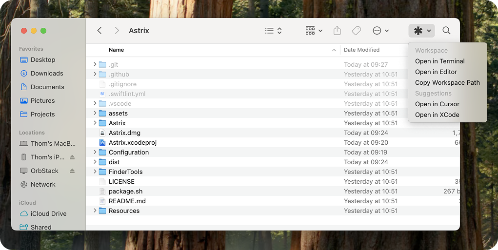

<!-- markdownlint-disable-next-line first-line-heading -->

Welcome to **Astrix**! Your one-stop solution for easy finder management. This project is meant to help you improve your productivity by providing a simple and easy-to-use finder tool that helps you get into development faster.

## Project Overview

Astrix is a macOS finder extension which adds a button to your finder toolbar. With this button you have the possibility to open that specific folder in your editor/terminal of choice. To get started with Astrix, you can simply open the app, walk through the onboarding and Astrix will be ready in your Finder app.

The application is built using SwiftUI and Swift and is available for macOS 14.0 and above.

## Getting Started

1. Download the latest version of Astrix from the [releases page](https://github.com/thom1606/Astrix/releases).
2. Open the DMG and install the app into your Applications folder.
3. Open the app and follow the onboarding steps.
4. Once the onboarding is complete, you can start using Astrix in your Finder app.
5. If you are not able to see the Astrix app in your Finder app, you can enable it by right clicking on the `Finder toolbar` > `Customize toolbar` > and selecting the Astrix app.

## Features

- Open your current folder in your editor of choice.
- Open your current folder in your terminal of choice.
- We suggest you to open in editors based on the contents of the folder (XCode, VSCode, Cursor).
- Open the current folder path.

## Sponsorship

If you like the project and would like to support the development, you can sponsor the project on [Github Sponsors](https://github.com/sponsors/thom1606). Your support will help me to continue working on the project and add new features.

## Feature Requests?

If you have any feature requests, don't hesitate to open an issue on the repository. We are always looking for ways to improve the project and support your needs.

### Requesting a new editor or terminal?

If you have a specific editor or terminal you would like to see in the project, please open an issue and we will look into adding it to the project. It would be really helpful if you could provide the following information:
- Name of the editor or terminal.
- The bundle id of the app.
- The open command for the app. _(by default it will be open -b \<bundle-id> \<path>)_
